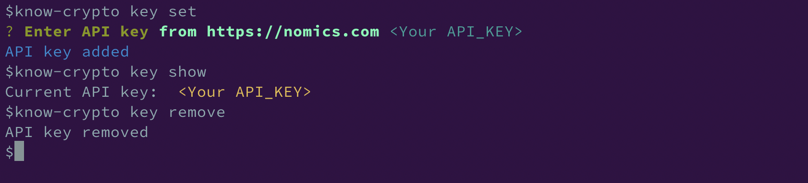
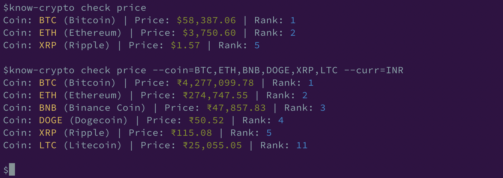

# know-crypto-cli

A node-cli to check the prices of crypto using nomics APIs. Find more about nomics at https://nomics.com/docs

## Installation

The very first thing you need to do is to do a global installation of the package by shooting🔫 the following command in your favourite terminal. Let's go... 🚀
```
npm install -g know-crypto

(or)

npm i -g know-crypto

```

## Prerequisites

Get an API key from https://nomics.com before you get started. Check out their docs https://nomics.com/docs#tag/Currencies to know more about the use case we are trying to do here


## Getting Started

The following information will give you a brief overview of how you can use `know-crypto` to get crypto prices using the terminal

### Usage

- `know-crypto -h` - To get the list of available commands and options

    ```
    Usage: know-crypto [options] [command]

    Options:
    -V, --version   output the version number
    -h, --help      display help for command

    Commands:
    key             Manage API key using https://nomics.com
    check           Check coin price info
    help [command]  display help for command
    ```

- `know-crypto key` - Will give you various options to get/set/delete the **API key** for the nomics API
    ```
    Usage: know-crypto-key [options] [command]

    Options:
    -h, --help      display help for command

    Commands:
    set             Set API key -- Get from https://nomics.com
    show            Show API key
    remove          Remove API key
    help [command]  display help for command
    ```
    

 - `know-crypto check` - Will give you options/commands to check the price
    ```
    Usage: know-crypto-check [options] [command]

    Options:
    -h, --help       display help for command

    Commands:
    price [options]  Check price of coins
    help [command]   display help for command
    ```

## Check the prices of crypto coins

 - `know-crypto check price -h` - will you option to customize what you want to get. By default option `coin` will be set to "BTC,ETH,XRP" and `curr` to "USD"

    ```
    Usage: know-crypto-check price [options]

    Check price of coins

    Options:
    --coin <type>  Add specific coin types in CSV format (default: "BTC,ETH,XRP")
    --curr <type>  Change the currency (default: "USD")
    -h, --help     display help for command
    ```

## Examples




## Authors

* **Dinesh Nadimpalli** - [Github](https://github.com/dineshnadimpalli)

See also the list of [contributors](https://github.com/your/project/contributors) who participated in this project.

## License

This project is licensed under the MIT License - see the [LICENSE.md](LICENSE.md) file for details
